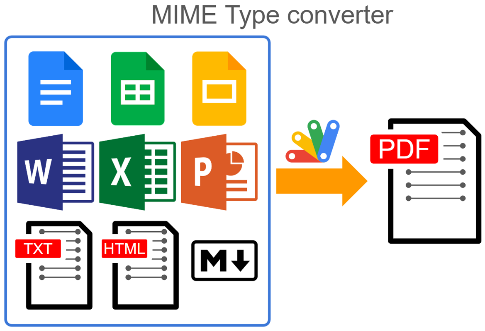

# MimeTypeApp

<a name="top"></a>
[MIT License](LICENCE)

<a name="overview"></a>

# Overview

This is a Google Apps Script library for converting files from various MIME types to a specified target MIME type. The library accepts both file IDs and blobs as input values.



<a name="description"></a>

# Description

Recently, I encountered a scenario where I needed to convert files of various MIME types to a specific target MIME type. While converting files with known source MIME types is relatively straightforward, the process becomes more complex when the source MIME type is unknown. To simplify this task, I developed a Google Apps Script solution that can effectively convert files of diverse MIME types to a desired target MIME type. The script can accept both file IDs and blobs as input values.

# Principle

This library follows the principles outlined below:

1. Retrieve `importFormats` and `exportFormats` information about the user's Drive using the `about.get` method of the Drive API v3. [Ref](https://developers.google.com/drive/api/reference/rest/v3/about/get)
2. Based on the retrieved formats, create a conversion route that transforms the source mimeType to the target mimeType.
3. Apply the created route to convert the source mimeType to the target mimeType.

## Example:

Consider converting from `text/html` to `text/markdown`. Here's the conversion route:

1. `text/html`
2. `application/vnd.google-apps.document` (achieved by importing from `text/html`)
3. `text/markdown` (achieved by exporting from `application/vnd.google-apps.document`)

## Current Limitations:

This library cannot directly retrieve the content (blob) from Google Docs files (Documents, Spreadsheets, Slides, etc.) because of the current specification at Google side. Therefore, for the above route, while `text/html` and `text/markdown` can be handled as blobs, the intermediate step (`application/vnd.google-apps.document`) requires file access. This library takes this limitation into account.

When this library is used, the conversion from `application/vnd.google-apps.spreadsheet` to `application/vnd.google-apps.document` can be achieved. But, in this case, the format might be broken. So, please be careful about this.

# Library's project key

```
112yLH6obJWYpE8RY89DTF7CLp-SEZ2tnA3pesP5Lubq-qmujLkQJao5-
```

<a name="usage"></a>

# Usage

## 1. Use this as a library

In order to use this as a library, please install the library as follows.

1. Create a GAS project.

   - You can use this library for the GAS project of both the standalone type and the container-bound script type.

1. [Install this library](https://developers.google.com/apps-script/guides/libraries).

   The library's project key is **`112yLH6obJWYpE8RY89DTF7CLp-SEZ2tnA3pesP5Lubq-qmujLkQJao5-`**.

## 2. Use this as a standalone

In order to use this as a standalone, please copy and paste the [class MimeTypeApp script](https://github.com/tanaikech/MimeTypeApp/blob/master/MimeTypeApp.js) into your project.

# Scopes

This library uses the following scopes.

- `https://www.googleapis.com/auth/drive`
- `https://www.googleapis.com/auth/script.external_request`

# Constructor

This script can be used as a Google Apps Script library and a standalone script.

When you want to use this as a Google Apps Script library, please install it to your project as a library and use the constructor as follows.

```javascript
const m = MimeTypeApp;
```

When you want to use this as a standalone script, please copy and paste the class MimeTypeApp script to your project and use the constructor as follows.

```javascript
const m = new MimeTypeApp();
```

The former is used in the following sample scripts.

# IMPORTANT

- Important Note: When retrieving a blob from Google Docs files (Documents, Spreadsheets, Slides, etc.) using Google Apps Script, the original mimeType is automatically converted to PDF (`application/pdf`).
- To convert the original mimeType of Google Docs files, use the file ID instead of the blob. When using a blob from Google Docs files, the source mimeType will always be PDF. Please be aware of this limitation.
- When the target mimeType is a Google Docs file, the output will be the file ID, not a blob. This is because Google Docs files cannot be directly converted to blobs.
- This library converts MIME types using exportFormats and importFormats of the [about.get](https://developers.google.com/drive/api/reference/rest/v3/about/get) method. However, there are MIME types it cannot convert. Additionally, format integrity might be compromised when converting between certain Google Docs formats, such as converting a Google Spreadsheet to a Google Document. Please use caution.
- This library might not be able to be used for large data.
- When you give a lot of file IDs or blobs, this library might not be able to work correctly in the maximum execution time (6 minutes).

# Methods

| Methods                                   | Description                                                                                                                                                                                                                                                                                                                                   |
| :---------------------------------------- | :-------------------------------------------------------------------------------------------------------------------------------------------------------------------------------------------------------------------------------------------------------------------------------------------------------------------------------------------- |
| [setFileIds(fileIds)](#setfileIds)        | Set file IDs.                                                                                                                                                                                                                                                                                                                                 |
| [setBlobs(blobs)](#setblobs)              | Set blobs.                                                                                                                                                                                                                                                                                                                                    |
| [getConversionList()](#getconversionlist) | Get a conversion list. When this is run, the list of the mime types that this library can convert is returned.                                                                                                                                                                                                                                |
| [getAs(object)](#getas)                   | Converted to the given mimeType. When the target MIME type is a Google Docs file (Document, Spreadsheet, Slide, etc.), the destination data type must be a file. Therefore, the file ID is returned. When the target MIME type is not a Google Docs file, the blob can be returned as the destination data type. Hence, the blob is returned. |
| [getThumbnails(width)](#getthumbnails)    | Get thumbnail images from the file IDs.                                                                                                                                                                                                                                                                                                       |

- When the file IDs and the blobs are converted, this script (library) returns the file IDs or the blobs of the converted data. In the current stage, when the target MIME type is a Google Docs file (Document, Spreadsheet, Slide, etc.), the destination data type must be a file. Therefore, the file ID is returned. When the target MIME type is not a Google Docs file, the blob can be returned as the destination data type. Hence, the blob is returned.

<a name="setfileIds"></a>

## setFileIds

Set file IDs.

```javascript
const fileIds = ["fileId1", "fileId2", , ,];
const m = MimeTypeApp;
m.setFileIds(fileIds);
```

<a name="setblobs"></a>

## setBlobs

Set blobs.

```javascript
const blobs = [blob1, blob2, , ,];
const m = MimeTypeApp;
m.setBlobs(blobs);
```

<a name="getconversionlist"></a>

## getConversionList

Get a conversion list. When this is run, the list of the mime types that this library can convert is returned.

```javascript
const m = MimeTypeApp;
const res = m.getConversionList();
console.log(res);
```

<a name="getas"></a>

## getAs

This method might be the main method of this library.

Converted to the given mimeType. When the target MIME type is a Google Docs file (Document, Spreadsheet, Slide, etc.), the destination data type must be a file. Therefore, the file ID is returned. When the target MIME type is not a Google Docs file, the blob can be returned as the destination data type. Hence, the blob is returned.

```javascript
const dstFolderId = "###FolderID###";

const fileIds = ["###fileId1##", "###fileId2##", "###fileId3##"];

const object = {
  mimeType: "application/pdf", // Target MIME type

  onlyCheck: false, // The default value is false. When set to true, it verifies whether the input file IDs or blobs can be converted to the target MIME type and returns the verified result. When this is false, the converted data (file IDs or blobs) is returned.

  folderId: dstFolderId, // Destination folder ID. The default folder is "root." When the target MIME type is a Google Docs file (Document, Spreadsheet, Slide, etc.), the converted data is required to be created as a file. When this is set, the created files are put into this folder.
};

const m = MimeTypeApp;
const res = m.setFileIds(fileIds).getAs(object);

// When you create the output data as the files.
const folder = DriveApp.getFolderById(dstFolderId);
res.forEach((blob) => {
  if (blob && blob.toString() == "Blob") {
    folder.createFile(blob);
  }
});
```

### Input value

- If you want to give the blobs as the input value, please use the `setFileIds` method.

- If you want to give the blobs as the input value, please use the `setBlobs` method. But, in this case, only the data except for Google Docs files can be used. Please be careful about this.

### Output value

The output value is an array. But, each element depends on the following cases.

- When the target mimeType is a Google Docs file (Document, Spreadsheet, Slide, and so on), the file ID is returned.
- When the target mimeType is not a Google Docs file (Document, Spreadsheet, Slide, and so on), the blob is returned.
- When the source mimeType cannot be converted to the target mimeType, `null` is returned.

### Sample 1

The source and target mimeTypes are `text/markdown` and `application/vnd.google-apps.document`, respectively.

```javascript
const fileIds = ["###fileId of text/markdown###"];
const object = { mimeType: "application/vnd.google-apps.document" };

const m = MimeTypeApp;
const res = m.setFileIds(fileIds).getAs(object);
Logger.log(res);
```

`res` is an array that includes the file ID of the converted file. And, the converted file is created in the root folder. If you want to create the files for the specific folder, please use `folderId` in `object`.

### Sample 2

The source and target mimeTypes are `application/vnd.google-apps.document` and `text/markdown`, respectively.

```javascript
const fileIds = ["###fileId of application/vnd.google-apps.document###"];
const object = { mimeType: "text/markdown" };

const m = MimeTypeApp;
const res = m.setFileIds(fileIds).getAs(object);
Logger.log(res);
```

`res` is an array that includes the blob of the converted data.

<a name="getthumbnails"></a>

## getThumbnails

This method returns the thumbnail as the blob. In this case, please give the file IDs. The argument of `1000` of the `getThumbnails` method is the width of the output image. When you want to change the width of the thumbnail image, please modify it.

```javascript
const dstFolderId = "###FolderID###";
const fileIds = ["###fileId1##", "###fileId2##", "###fileId3##"];

const m = MimeTypeApp;
const res = m.setFileIds(fileIds).getThumbnails(1000);

// When you create the output data as the files.
const folder = DriveApp.getFolderById(dstFolderId);
res.forEach((blob) => {
  if (blob && blob.toString() == "Blob") {
    folder.createFile(blob);
  }
});
```

---

<a name="licence"></a>

# Licence

[MIT](LICENCE)

<a name="author"></a>

# Author

[Tanaike](https://tanaikech.github.io/about/)

[Donate](https://tanaikech.github.io/donate/)

<a name="updatehistory"></a>

# Update History

- v1.0.0 (December 4, 2023)

  1. Initial release.

[TOP](#top)
